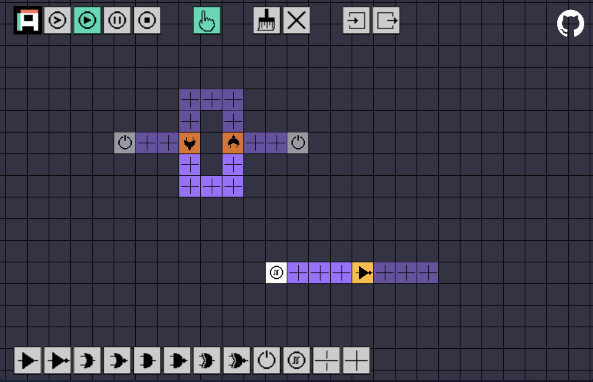

<p align="center">
  
  <a href="https://ampix.codecat.io/">Live Demo</a>
</p>

# AmPix

AmPix is an intuitive and interactive visual computing tool that empowers you to design and experiment with logic circuits using pixels. Whether you're a student, educator, or electronics enthusiast, this open-source project offers a simple but user-friendly environment to explore digital logic.

## Features:
- Pixel-Based Interface: Craft your circuits visually with easy-to-draw pixels representing wires, gates, and components.
- Real-Time Simulation: Witness your circuit in action with live simulation and instant visual feedback.
- Educational: Ideal for students and educators seeking hands-on learning of logic circuit concepts.

## Screenshots

<p align="center">
  
</p>

## Local development setup

```bash
npm i
npm run dev
```

## License

MIT License

Copyright (c) 2024 Mateusz Russak
